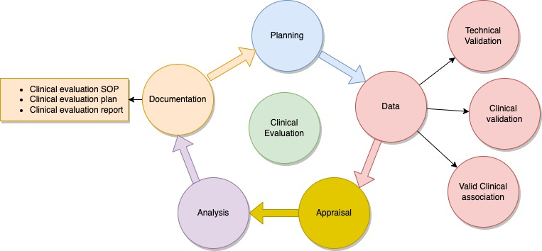
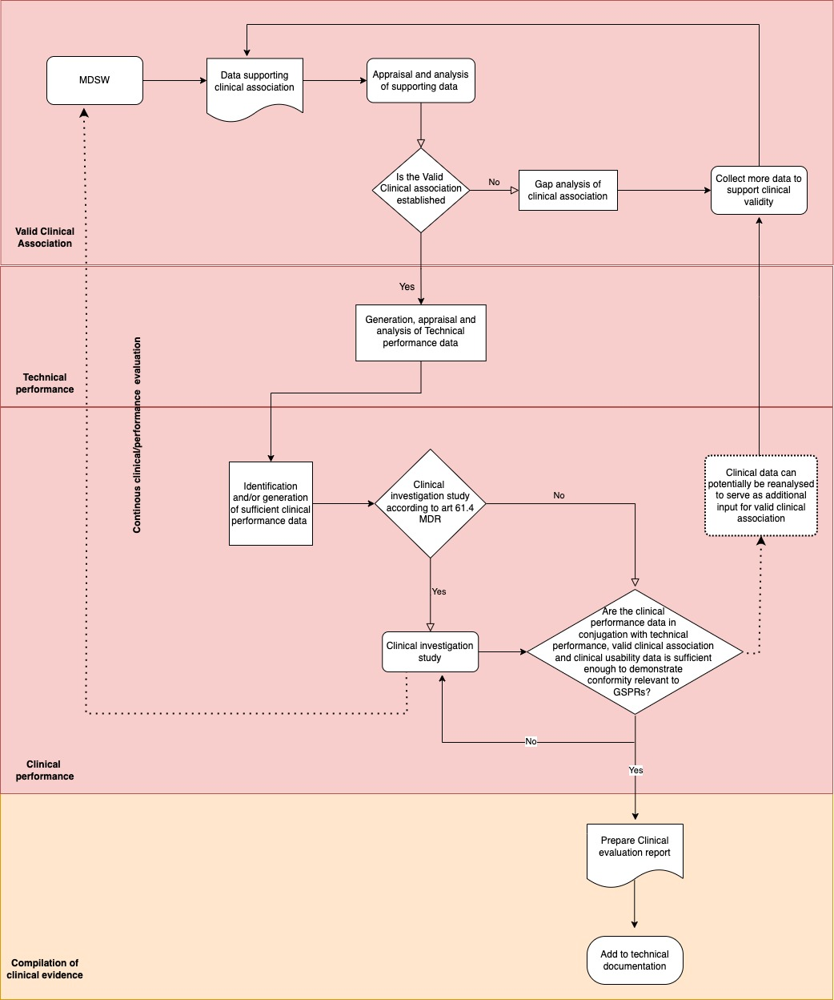

= Clinical Evaluation Plan (CEP)

== Scope of the Clinical Evaluation

The primary purpose of this CEP is to serve as a guiding material for the clinical evaluation of ARC. The clinical evaluation will scrutinize the clinical safety and performance of ARC, which is a Class IIa SaMD being developed and provided by apoplex medical technologies GmbH. The clinical evaluation of medical devices is a systematic and a planned investigation or study that demonstrates the safety and performance of the medical device in clinical use by contributing continuous generation, collection, analysis, and evaluation of clinical data. It is an important part in the conformity assessment process to obtained CE marking. As outlined in Article 61 and Annex XIV of MDR, SaMD’s clinical performance and safety assessment is based on the evaluation of relevant clinical data and is mandatory for all medical device classes. The clinical evaluation and the clinical data used are intended to investigate whether the clinical safety and performance of the ARC software are met. 

According to MEDDEV 2.7/1 rev. 4, the clinical evaluation process includes five stages to evaluate the safety data and performance of the SaMD. These are (Figure 1):

*Stage 0: Planning/Scope* – scope (objective and structure) of the clinical evaluation/preparation of CEP, product classification, intended use

*Stage 1: Identification* – identification of relevant clinical data (Figure 2)

*Stage 2: Appraisal* – evaluation of identified clinical data

*Stage 3: Analysis* – analyzing clinical data for proving the valid clinical association

*Stage 4: Documentation* – generation of clinical evaluation report

The clinical evaluation evidence of ARC, is generated by demonstrating the following: 

•	*Valid clinical Association*: A valid association between the ARC output and the targeted clinical condition is established and is based on the findings from literature research, clinical experience, and clinical investigations (See literature research part). 

•	*Technical Validation*: To demonstrate the technical validation of ARC, the ability of the ARC to process input data correctly and to generate accurate and reliable output data is tested by performing the V&V activities during the software development process. Some of the parameters for demonstrating the technical validation includes data availability, data confidentiality, reliability, accuracy, absence of inacceptable cybersecurity vulnerabilities etc.

•	*Clinical validation*: For this part, it is important to demonstrate that the data produced by the SaMD is clinically relevant in accordance with the medical purpose. The validation of clinical performance can be characterized by the demonstration of applicable clinical data to ARC, such as: sensitivity, specificity, positive predictive value (ppv), negative predictive value (npv), etc. For demonstrating the clinical validation of ARC, the analysis results of the new algorithm are compared with the result of the former algorithm (SRA), using the benchmark tests of the so-called IDEAS study as well as with the expected results from the end user.  

=== Device description

ARC is an AI based software that is designed to facilitate the analysis of ECG data to detect atrial fibrillation (VHF, AF) as reliably as possible 

==== Indication and contraindication

CHA2DS2-VASc-Score: ≥1

*Indication*

The ARC will be mainly used in the context of stroke prevention, on the one hand in the primary prevention of stroke (screening) and on the other hand in the secondary prevention of stroke (clarification of the cause of stroke). Strokes can be prevented by detecting and treating atrial fibrillation. The algorithm used in ARC detects episodes of manifest AF (absolute arrhythmia) from the ECG data.  

Other indications: Palpitation, Murmur, Chest pain, Shortness of breath, Syncope, Lightheadedness or dizziness, Sweating

*Contraindication*

Patient refusal, Allergy to the adhesive used to affix the leads for ECG. Furthermore, the ECG of patients with pacemakers, left or right bundle branch block (intraventricular conduction disturbance), severe ventricular extrasystoles (ventricular extrasystoles) and / or pharmacological cardioversions (use of drugs in certain cardiac arrhythmias to return them to normal heart rhythm) cannot be analyzed.

==== Intended users and patient population

*Intended patient population*

ARC is used in patients with risk factors for AF (primary prevention) and stroke and TIA patients (secondary prevention/causal clarification of AF). The intended patient group includes patients with a high risk of stroke (CHA2 DS2 -VASc score ≥1).
Intended users

ARC analysis is used by medical assistants and specialists in hospitals, clinics with stroke units, acute care hospitals treating stroke and TIA patients, cardiac rehabilitation clinics, and primary care physicians and specialists. The analysis reports are evaluated by cardiologically qualified physicians within the scope of the services offered by apoplex medical technologies. 

==== Clinical Benefits and Safety

The purpose of reviewing relevant clinical data is to demonstrate if
•	the SaMD in question achieves the intended medical purpose when used as claimed, 
•	has been designed and manufactured to be suitable, safe, and effective for the intended use as determined by the manufacturer,
•	does not compromise the clinical condition or safety of patients or the safety or health of users or third parties,
•	has an acceptable benefit/risk profile, known and foreseeable risks and other adverse effects are minimized and acceptable when weighed against the benefits and intended use,
•	any statements about the product, its safety and performance are supported by appropriate evidence.
•	is compatible with a high level of health and safety protection, and
•	is based on the generally accepted state of the art.

Since ARC is used to detect AF as a risk factor for stroke as reliably as possible. Based on the general safety and performance requirements, the clinical benefits of ARC can be stated as:

•	Fast and reliable results for better and precise diagnosis and treatment decisions 
•	Accuracy
•	Sensitivity
•	Specificity
•	Positive predictive value (ppv)
•	Negative predictive value (npv)

These claims are checked within the clinical evaluation and evidence are generated. The terms are explained in Table 1. High sensitivity is particularly important, while high specificity is used to prove the presence of a disease. 

|===
|*Term*   |*Definition / Explanation*

|Sensitivity (Sen)
|Proportion of "sick people" detected by test out of all "sick people"

|Specificity (Spe)
|Proportion of "healthy" persons detected by test out of all "healthy" persons

|Positive predictive value (ppv)
|Probability that the disease is actually present if the test result is positive.

|Negative predictive value (npv)
|Probability that the disease is not present if the test result is negative.

|===

Table 1: Key performance terms

Clinical safety of ARC is demonstrated with reference to determination of risk and its side-effects. These can be in terms of the following:

•	Functional errors
•	Data errors
•	Resilience and reliability errors
•	Usability issues
•	Specificity and sensitivity concerns
•	Privacy and security problems

Some of the examples are in the table below. 

|=== 

| *Harm*      | *Effect*
|False positive analysis result
|Further treatment due to false positive analysis is performed

|Incorrect assignment of the analysis report
|A patient with AF is not recognized

|Presentation of a non-representative 5-minute episode
|A patient with AF is not recognized and will not be treated accordingly

|Wrong interpretation of the analysis results due to untrained personnel
|A patient with AF is not recognized and will not be treated accordingly

|Wrong interpretation of the analysis results due to misleading presentation or unreadable
analysis result
|A patient with AF is not recognized and will not be treated accordingly

|===

A post market clinical follow up is also incorporated to cross check the above-mentioned clinical concerns. 

== Type of Evaluation

The clinical evaluation of ARC is based on the demonstration of well-established clinical association. In order to prove a valid clinical association, the analysis results of the new algorithm are compared with the result of the former algorithm (SRA), using the tests of the so-called IDEAS study as a benchmark as well as other studies conducted with SRA. The methodology for performing literature search to achieve adequate clinical data is described in part 3.

== Literature Research

=== Literature Search Methods: Clinical data collection

To obtain information on the clinical safety and performance of the ARC, various databases are searched. Databases operated by (inter-)national authorities dealing with market surveillance as well as approval of medical devices were focus on. BfArM (Germany), MHRA (UK) and Swissmedic (Switzerland), were selected to collect data as these serve as proxies for other European databases. Databases maintained by the FDA (USA) (MAUDE, Medical Device Recalls, Warning Letters) are not evaluated because SRA is not used in the USA.

The DIMDI database serves as an information system for medical devices according to §33 MPG to improve the market surveillance of medical devices in Germany. Nevertheless, DIMDI only lists manufacturers of defined medical devices, which is why DIMDI is not suitable for evaluating field actions, recalls, etc. As an alternative, the BfArM database is searched.

Since SRA has been in use since 2007, the search is performed with keywords that refer exclusively to SRA (SRA, apoplex, stroke risk analysis). Unless otherwise stated, there is no narrowing of the search results.

In addition to the databases mentioned above, other databases are searched to obtain more in-depth information on clinical trials and scientific literature on SRA. The databases clinical trials.gov and PubMed are used for this purpose. For the clinical trials database, the same keywords are used as for the serious events (SRA, apoplex, stroke risk analysis). For PubMed, however, keywords are defined according to the PICO scheme. The number of search terms is more extensive for PubMed, since this database contains more than 30 million publications and, for reasons of efficiency, only specific hits directly dealing with SRA itself are evaluated.

|===

|  *P*  |  *I*  |  *C*  | *O*

|Patient
Population problem
|Intervention
|Comparison
Control
|Outcome

|•	atrial fibrillation

•	pAF

•	stroke

•	ischaemic attack

•	pxAF

•	POAF

•Cardioembolism

|•	automated software algorithm

•	SRAclinic

•	SRA

•	Apoplexy

•	ACEM

•	SARF

•	automated complexity-based statistical stroke risk analysis

•	software analysis

|•	ECG

•electrocardiogram

•	routine diagnostic

•	staff-based analysis

•	cardiologist

•	CEM

•electrocardiography

•	stroke unit

•	continius cardiac monitoring

|•	pAF detection

•	diagnostic effectiveness

•	sensitivity

•	specificity

•	prevalence

•	PPV

•	NPV

•	LR+

•	LR-

===