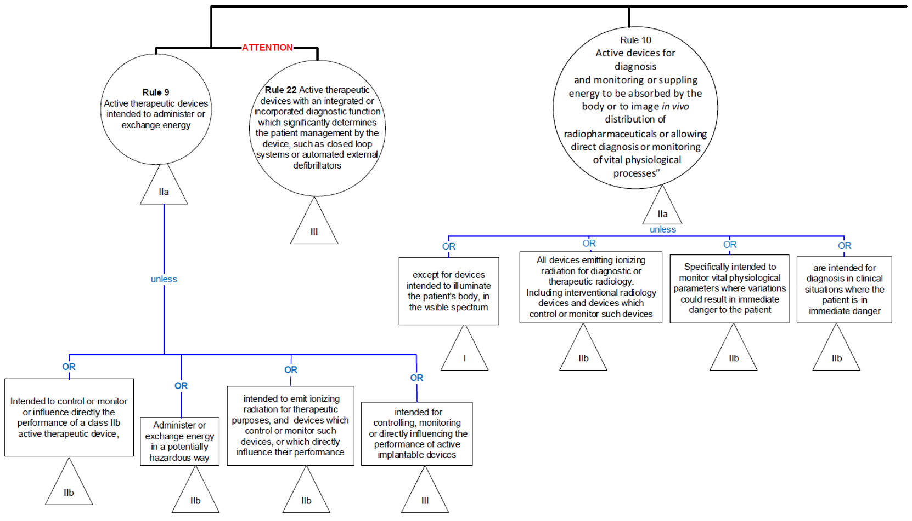
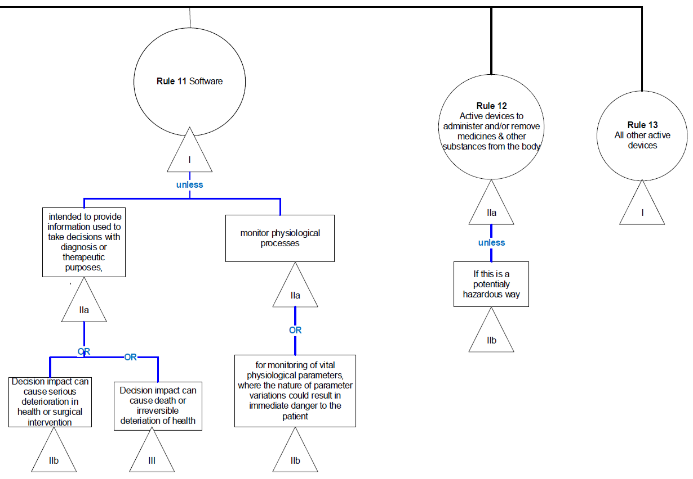

== Medical Device risk class

*_Risk class IIa (MDR, Annex VIII, rule 11)_*

Rules taken into consideration: MDR, Annex VIII

Non-Invasive device: Chapter 1 (pt. 2), Chapter 3, (pt. 4, Rule 1 - 4)

Invasive device: Chapter 1 (pt. 2), Chapter 3, (pt. 5, Rule 5 - 8)

#_Active devices: Chapter 1 (pt. 2), Chapter 3, (pt. 6, Rule 9 – 13)_#

Special rules: Chapter 1 (pt. 2), Chapter 3, (pt. 7, Rule 14 - 22)

=== Reasoning

Article 2 of EU-MDR (2017/745) defines a medical device and active device as follows:

‘Medical device’ means any instrument, apparatus, appliance, software, implant, reagent, material or other article intended by the manufacturer to be used, alone or in combination, for human beings for one or more of the following specific medical purposes

diagnosis, prevention, monitoring, prediction, prognosis, treatment or alleviation of disease,

diagnosis, monitoring, treatment, alleviation of, or compensation for, an injury or disability,

investigation, replacement or modification of the anatomy or of a physiological or pathological process or state,

providing information by means of in vitro examination of specimens derived from the human body, including organ, blood and tissue donations

‘Active device’ means any device, the operation of which depends on a source of energy other than that generated by the human body for that purpose, or by gravity, and which acts by changing the density of or converting that energy. Devices intended to transmit energy, substances or other elements between an active device and the patient, without any significant change, shall not be deemed to be active devices.

Software shall also be deemed to be an active device

As per MDCG 2019-11 Guidance on Qualification and Classification of Software in Regulation (EU) 2017/745 – MDR and Regulation (EU) 2017/746 – IVDR, 

Defination of Medical Device Software (MDSW): 

Medical device software is software that is intended to be used, alone or in combination, for a purpose
as specified in the definition of a “medical device” in the MDR or IVDR, regardless of whether the software is independent or driving or influencing the use of a device.

==== Classification Rules: 

Since ARC is a medical device software, Rules 9 to 13 for active medical device and rule 22 for closed loop system are taken into consideration and are explaned as follows: 

*Rules 9, 10 and 12* are mainly associated with risks related to the exchange of energy/substances between the  body  and  diagnostic  or  therapeutic  active  devices,  taking  into  account  the  different  healthcare  situations (condition of patients). 

*_These rules do not apply to ARC as it is not a therapeutic device and will not be performing the stated function._* 

*Rule 22* is for Closed loop systems meaning that the active therapeutic devices with an integrated or incorporated diagnostic function which significantly determines the patient management by the device, such as closed loop systems or automated external defibrillators and such devices will be classified as class III.  

*_This rule also do not apply to ARC as it does not perform the stated purpose mentioned in the rule._* 

*Rule 11*: Software for decisions with diagnosis or therapeutic purposes or software intended to monitor physiological processes  

#Rule 11 states: Software  intended  to  provide  information  which  is  used  to  take  decisions  with  diagnosis  or  therapeutic  purposes  is  classified  as  class  IIa#,  except  if  such  decisions  have  an  impact  that  may cause: death or an irreversible deterioration of a person's state of health, in which case it is in class III; or a serious deterioration of a person's state of health or a surgical intervention, in which case it is classified as class IIb.  

Software intended to monitor physiological processes is classified as class IIa, except if it is intended  for  monitoring  of  vital  physiological  parameters,  where  the  nature  of  variations  of  those parameters is such that it could result in immediate danger to the patient, in which case it is classified as class IIb.  

All other software is classified as class I. 

The text of Rule 11 can be divided into three sub-rules and are applied depending on the intended use/purpose of the MDSW: 

#11a:  (3  first  paragraphs  of  Rule  11)  intended  to  provide  information  which  is  used  to  take  decisions with diagnostic or therapeutic purposes;# 

#The  wording  “intended  to  provide  information  which  is  used  to  take  decisions  with  diagnosis  or  therapeutic purposes” describes, in very general terms, the “mode of action” which is characteristic of all  MDSW.    Therefore,  this  sub-rule  is  generally  applicable  to  all  MDSW  (excluding  those  MDSW  that have no medical purpose). Sub-rule  11a),  states  that  MDSW  (which  is  intended  to  provide  information  which  is  used  to  take  decisions with diagnosis or therapeutic purposes) is classified as class IIa.# 

There  are  two  exceptions  from  sub-rule  11a)  that  are  mainly  intended  to  apply  a  risk  classification  based  on  the  significance  of  the  provided  information  and  the  potential  impact  of  an  (incorrect)  decision made using information from the MDSW.

Accordingly, MDSW that is intended to provide information which is used to take decisions with diagnosis and therapeutic purposes, is at a higher risk class where such decisions, if based on incorrect information from the MDSW, are reasonably likely to have an impact that may cause: i.death or an irreversible deterioration of a person's state of health, in which case it is in class III; ii.serious  deterioration  of  a  person's  state  of  health  or  surgical  intervention,  in  which  case  it  is  classified as class IIb.

11b: (Paragraph 4 of Rule 11) intended to monitor physiological processes or parameters; 

MDSW  that  is  intended  to  monitor  physiological  processes  will,  under  most  circumstances,  provide  “information  which  is  used  to  take  decisions  with  diagnosis  or  therapeutic  purposes  and  hence  fall  under  sub-rule  11a.  Sub-rule  11b)  should  therefore  be  considered  as  a  specific  rule  for  MDSW  intended only for monitoring purposes. Sub-rule 11b) was introduced to ensure that MDSW which has the same intended purpose as (hardware) devices which would fall under rule 10, third indent, are in the same risk class.  However,  this  sub  rule  applies  to  MDSW  intended  to  be  used  for  monitoring  any/all  physiological  processes and not just vital physiological processes (equivalent to rule 10, third indent).  Vital  physiological  processes  and  parameters  include,  for  example,  respiration,  heart  rate,  cerebral  functions, blood gases, blood pressure and body temperature.

11c: (Paragraph 5 of Rule 11) all other uses and implies that all other MDSW is classified as class I. 

*_Since the intended purpose of ARC is to analyse the ECG data and provide information that will be used by the medical professionals to take decisions, therefore as per MDR, Annex VIII, rule 11, ARC is classified as Class IIa medical device._* 

== Indications and contraindications

CHA2DS2-VASc-Score: ≥1

|===
| Score | Risk Level

|0
|Low

|1
|Moderate

|>1
|High

|===

Indication: Palpitation, Murmur, Chest pain, Shortness of breath, Syncope, Lightheadedness or dizziness, Sweating

Contraindication: Patient refusal, Allergy to the adhesive used to affix the leads for ECG

Co-morbidities: Ischemic heart disease, hypertensive heart disease, valvular heart disease, congestive heart failure, COPD and diabetes 

== Essential performance

=== General Safety and Performance requirements

|===
|Chapter   | No.   |Requirements   |Applicable   |Rationale   |Applicable standard   |Evidence of Conformity

|1. General Requirements 
|
|
|
|
|
|

| 
|1
|Devices shall achieve the performance intended by their manufacturer and shall be designed and manufactured in such a way that, during normal conditions of use, they are suitable for their intended purpose. They shall be safe and effective and shall not compromise the clinical condition or the safety of patients, or the safety and health of users or, where applicable, other persons, provided that any risks which may be associated with their use constitute acceptable risks when weighed against the benefits to the patient and are compatible with a high level of protection of health and safety, taking into account the generally acknowledged state of the art.
| Yes
|
|ISO 14971:2019
|Intended Use, Risk Management Report, Clinical Evaluation Report

| 
|2 
|The requirement in this Annex to reduce risks as far as possible means the reduction of risks as far as possible without adversely affecting the benefit-risk ratio.
|Yes
|
|ISO 14971:2019
|Risk Management Report

|
| 3 
|Manufacturers shall establish, implement, document and maintain a risk management system. 

Risk management shall be understood as a continuous iterative process throughout the entire lifecycle of a device, requiring regular systematic updating. In carrying out risk management manufacturers shall: 
|Yes
|
|ISO 14971:2019
|SOP Risk Management

|
|(a)
|establish and document a risk management plan for each device;
|Yes
|
|ISO 14971:2019
|Risk Management Plan

|
|(b)
|identify and analyze the known and foreseeable hazards associated with each device;
|Yes
|
|ISO 14971:2019
|Risk Table

|
|(c)
|estimate and evaluate the risks associated with, and occurring during, the intended use and during reasonably foreseeable misuse;
|Yes
|
|ISO 14971:2019
|Risk Table

|
|(d)
|eliminate or control the risks referred to in point (c) in accordance with the requirements of Section 4;
|Yes
|
|ISO 14971:2019
|Risk Table

|
|(e)
|evaluate the impact of information from the production phase and, in particular, from the post-market surveillance system, on hazards and the frequency of occurrence thereof, on estimates of their associated risks, as well as on the overall risk, benefit-risk ratio and risk acceptability; and establish and document a risk management plan for each device;
|Yes
|
|ISO 14971:2019
|Risk Table
SOP Integrated Software Developmen

|
|(f)
|based on the evaluation of the impact of the information referred to in point (e), if necessary amend control measures in line with the requirements of Section 4.
|Yes
|
|ISO 14971:2019
|Risk Table

|
| 4 
|Risk control measures adopted by manufacturers for the design and manufacture of the devices shall conform to safety principles, taking account of the generally acknowledged state of the art. To reduce risks, Manufacturers shall manage risks so that the residual risk associated with each hazard as well as the overall residual risk is judged acceptable. In selecting the most appropriate solutions, manufacturers shall, in the following order of priority:
|Yes
|
| ISO 14971:2019
| Risk Table

|
|(a)
|eliminate or reduce risks as far as possible through safe design and manufacture;
|Yes
|
|ISO 14971:2019
|Risk Table

|
|(b)
|where appropriate, take adequate protection measures, including alarms if necessary, in relation to risks that cannot be eliminated; and
|Yes
|
|ISO 14971:2019
|Risk Table

|
|(c)
|provide information for safety (warnings/precautions/contra-indications) and, where appropriate, training to users.
|Yes
|
|ISO 14971:2019
|Risk Table

|
| 5
|In eliminating or reducing risks related to use error, the manufacturer shall:
|
|
|
|

|
|(a)
|reduce as far as possible the risks related to the ergonomic features of the device and the environment in which the device is intended to be used (design for patient safety), and
|Yes
|
|IEC 62366-1:2015 + COR1:2016
|Risk Table
Software Requirements List
Usability Evaluation Report

|
|(b)
|give consideration to the technical knowledge, experience, education, training and use environment, where applicable, and the medical and physical conditions of intended users (design for lay, professional, disabled or other users).
|Yes
|
|IEC 62366-1:2015 + COR1:2016
|Intended Use
Risk Table

|
| 6
|The characteristics and performance of a device shall not be adversely affected to such a degree that the health or safety of the patient or the user and, where applicable, of other persons are compromised during the lifetime of the device, as indicated by the manufacturer, when the device is subjected to the stresses which can occur during normal conditions of use and has been properly maintained in accordance with the manufacturer’s instructions.
|No
|Software Device
|
|

|
| 7
|Devices shall be designed, manufactured and packaged in such a way that their characteristics and performance during their intended use are not adversely affected during transport and storage, for example, through fluctuations of temperature and humidity, taking account of the instructions and information provided by the manufacturer.
|No
|Software device
|
|

|
| 8
|All known and foreseeable risks, and any undesirable side-effects, shall be minimized and be acceptable when weighed against the evaluated benefits to the patient and/or user arising from the achieved performance of the device during normal conditions of use.
|Yes
|
|ISO 14971
|Clinical Evaluation Report

|
| 9
|For the devices referred to in Annex XVI, the general safety requirements set out in Sections 1 and 8 shall be understood to mean that the device, when used under the conditions and for the purposes intended, does not present a risk at all or presents a risk that is no more than the maximum acceptable risk related to the product’s use which is consistent with a high level of protection for the safety and health of persons.
|No
|Annex XVI does not apply
|
|

|2. Requirements Regarding Design and Manufacture
|
|
|
|
|
|

|2.1
|
|Chemical, Physical and Biological Properties
|No
|Software device
|
|

|2.2
|
|Substances 
|No
|Software device
|
|

|2.3
|
|Infection and Microbiological Contamination
|No
|Software device
|
|

|2.4
|
|Devices Incorporating Materials of Biological Origin
|No
|Software device
|
|

|2.5 
|
|Construction of Devices and Interaction with their Environment
|
|
|
|

| 
|14.1
|If the device is intended for use in combination with other devices or equipment the whole combination, including the connection system shall be safe and shall not impair the specified performance of the devices. Any restrictions on use applying to such combinations shall be indicated on the label and/or in the instructions for use. Connections which the user has to handle, such as fluid, gas transfer, electrical or mechanical coupling, shall be designed and constructed in such a way as to minimise all possible risks, such as misconnection.
|No
|Software device
|
|

| 
|14.2
|Devices shall be designed and manufactured in such a way as to remove or reduce as far as possible:
|No
|Software device
|
|

| 
|(a)
|the risk of injury, in connection with their physical features, including the volume/pressure ratio, dimensional and where appropriate ergonomic features;
|No
|Software device
|
|

| 
|(b)
|risks connected with reasonably foreseeable external influences or environmental conditions, such as magnetic fields, external electrical and electromagnetic effects, electrostatic discharge, radiation associated with diagnostic or therapeutic procedures, pressure, humidity, temperature, variations in pressure and acceleration or radio signal interferences;
|Yes
|Software device
|IEC 62366-1:2015 + COR1:2016
|Risk Table
Usability Evaluation Report

| 
|(c)
|the risks associated with the use of the device when it comes into contact with materials, liquids, and substances, including gases, to which it is exposed during normal conditions of use;
|No
|Software device
|
|

| 
|(d)
|the risks associated with the possible negative interaction between software and the IT environment within which it operates and interacts;
|Yes
|
|ISO 14971:2919 
|Risk Table

| 
|(e)
|the risks of accidental ingress of substances into the device;
|No
|Software device
|
|

| 
|(f)
|the risks of reciprocal interference with other devices normally used in the investigations or for the treatment given; and
|No
|Software device
|
|

| 
|(g)
|risks arising where maintenance or calibration are not possible (as with implants), from ageing of materials used or loss of accuracy of any measuring or control mechanism.
|No
|Software device
|
|

| 
|14.3
|Devices shall be designed and manufactured in such a way as to minimize the risks of fire or explosion during normal use and in single fault condition. Particular attention shall be paid to devices the intended use of which includes exposure to or use in association with flammable or explosive substances or substances which could cause combustion.
|No
|Software device
|
|

| 
|14.4
|Devices shall be designed and manufactured in such a way that adjustment, calibration, and maintenance can be done safely and effectively
|Yes
|
|IEC 62304:2006 / AMD1:2015
|Software Development and Maintenance Plan

| 
|14.5
|Devices that are intended to be operated together with other devices or products shall be designed and manufactured in such a way that the interoperability and compatibility are reliable and safe.
|Yes
|
|IEC 62304:2006 / AMD1:2015
|Software Requirements List

| 
|14.6
|Any measurement, monitoring or display scale shall be designed and manufactured in line with ergonomic principles, taking account of the intended purpose, users and the environmental conditions in which the devices are intended to be used.
|No
|No measuring function
|
|

| 
|14.7
|Devices shall be designed and manufactured in such a way as to facilitate their safe disposal and the safe disposal of related waste substances by the user, patient or other person. To that end, manufacturers shall identify and test procedures and measures as a result of which their devices can be safely disposed after use. Such procedures shall be described in the instructions for use.
|No
|Software device
|
|

| 2.6
|
|Devices with a Diagnostic or Measurement Function
|No
|No measuring function
|
|

| 2.7
|
|Protection Against Radiation
|No
|No radiation
|
|

| 2.8
|
|Devices that Incorporate Electronic Programmable Systems and Softwares that are Devices Themselves
|
|
|
|

| 
|17.1
|Devices that incorporate electronic programmable systems, including software, or software that are devices in themselves, shall be designed to ensure repeatability, reliability and performance in line with their intended use. In the event of a single fault condition, appropriate means shall be adopted to eliminate or reduce as far as possible consequent risks or impairment of performance.
|Yes
|
|IEC 62304:2006 / AMD1:2015
|Intended Use
SOP Integrated Software Development
SOP Change Management

| 
|17.2
|For devices that incorporate software or for software that are devices in themselves, the software shall be developed and manufactured in accordance with the state of the art taking into account the principles of development life cycle, risk management, including information security, verification and validation.
|Yes
|
|IEC 62304:2006 / AMD1:2015
|Software Development and Maintenance Plan

| 
|17.3
|Software referred to in this Section that is intended to be used in combination with mobile computing platforms shall be designed and manufactured taking into account the specific features of the mobile platform (e.g. size and contrast ratio of the screen) and the external factors related to their use (varying environment as regards level of light or noise).
|Yes
|
|IEC 62304:2006 / AMD1:2015
|SOP Integrated Software Development
Software Requirements List

| 
|17.4
|Manufacturers shall set out minimum requirements concerning hardware, IT networks characteristics and IT security measures, including protection against unauthorized access, necessary to run the software as intended.
|Yes
|
|IEC 62304:2006 / AMD1:2015
|User Manual
Software Requirements List

| 2.9
|
|Active Devices and Devices Connected to Them
|
|
|
|

| 
|18.1
|For non-implantable active devices, in the event of a single fault condition, appropriate means shall be adopted to eliminate or reduce as far as possible consequent risks.
|Yes
|
|ISO 14971:2019
|Risk Table

| 
|18.2
|Devices where the safety of the patient depends on an internal power supply shall be equipped with a means of determining the state of the power supply and an appropriate warning or indication for when the capacity of the power supply becomes critical. If necessary, such warning or indication shall be given prior to the power supply becoming critical.
|No
|Safety does not depend on power supply
|
|

| 
|18.3
|Devices where the safety of the patient depends on an external power supply shall include an alarm system to signal any power failure.
|No
|Safety does not depend on power supply
|
|

| 
|18.4
|Devices intended to monitor one or more clinical parameters of a patient shall be equipped with appropriate alarm systems to alert the user of situations which could lead to death or severe deterioration of the patient’s state of health.
|No
|No monitoring of clinical parameters
|
|

| 
|18.5
|Devices shall be designed and manufactured in such a way as to reduce as far as possible the risks of creating electromagnetic interference which could impair the operation of the device in question or other devices or equipment in the intended environment.
|No
|Software device
|
|

| 
|18.6
|Devices shall be designed and manufactured in such a way as to provide a level of intrinsic immunity to electromagnetic interference such that is adequate to enable them to operate as intended.
|No
|Software device
|
|

| 
|18.7
|Devices shall be designed and manufactured in such a way as to avoid, as far as possible, the risk of accidental electric shocks to the patient, user or any other person, both during normal use of the device and in the event of a single fault condition in the device, provided the device is installed and maintained as indicated by the manufacturer.
|No
|Software device
|
|

| 
|18.8
|Devices shall be designed and manufactured in such a way as to protect, as far as possible, against unauthorized access that could hamper the device from functioning as intended.
|Yes
|
|ISO 14971:2019
|Technical and Organizational Measures
Software Requirements List

| 2.10
|
|Particular requirements for active implantable devices
|No
|Software device
|
|

| 2.11
|
|Protection Against Mechanical and Thermal Risks
|No
|Software device
|
|

| 2.12
|
|Protection against the risks posed to the patient or user by devices supplying energy or substances
|No
|Software device
|
|

| 2.13
|
|Protection against the risks by medical devices intended by manufacturers for use by lay persons
|
|
|
|

| 
|22.1
|Devices for use by lay persons shall be designed and manufactured in such a way that they perform appropriately for their intended purpose taking into account the skills and the means available to lay persons and the influence resulting from variation that can be reasonably anticipated in the lay person’s technique and environment. The information and instructions provided by the manufacturer shall be easy for the lay person to understand and apply.	
|Yes
|
|IEC 62366-1:2015 + AC:2015
|Intended Use
User Manual
Usability Evaluation Report

| 
|22.2
|Devices for use by lay persons shall be designed and manufactured in such a way as to:
|
|
|
|

| 
|
|— ensure that the device can be used safely and accurately by the intended user at all stages of the procedure, if necessary after appropriate training and/or information,
|Yes
|
|IEC 62366-1:2015 + AC:2015
|Usability Evaluation Report, (Record of User Training)

| 
|
|— reduce, as far as possible and appropriate, the risk from unintended cuts and pricks such as needle stick injuries, and
|No
|Software device
|
|

| 
|
|— reduce as far as possible the risk of error by the intended user in the handling of the device and, if applicable, in the interpretation of the results.
|Yes
|
|IEC 62366-1:2015 + AC:2015
|Usability Evaluation Report

| 
|22.3
|Devices for use by lay persons shall, where appropriate, include a procedure by which the lay person:
|
|
|
|

| 
|
|— can verify that, at the time of use, the device will perform as intended by the manufacturer, and
|Yes
|
|IEC 62366-1:2015 + AC:2015
|Stakeholder Requirements, Usability Evaluation Report

| 
|
|— if applicable, is warned if the device has failed to provide a valid result.
|Yes
|
|IEC 62366-1:2015 + AC:2015
|Stakeholder Requirements, Usability Evaluation Report

|3. Requirements Regarding the Information Supplied with the Device  
|
|
|
|
|
|

|3.1 
|
|Label and Instructions for Use
|
|
|
|

| 
|23.1
|Each device shall be accompanied by the information needed to identify the device and its manufacturer, and by any safety and performance information relevant to the user, or any other person, as appropriate. Such information may appear on the device itself, on the packaging or in the instructions for use, and shall, if the manufacturer has a website, be made available and kept up to date on the website, taking into account the following:
|
|
|
|

| 
|(a)
|The medium, format, content, legibility, and location of the label and instructions for use shall be appropriate to the particular device, its intended purpose and the technical knowledge, experience, education or training of the intended user(s). In particular, instructions for use shall be written in terms readily understood by the intended user and, where appropriate, supplemented with drawings and diagrams.
|Yes
|
|IEC 62304:2006 / AMD1:2015
|User Manual

| 
|(b)
|The information required on the label shall be provided on the device itself. If this is not practicable or appropriate, some or all of the information may appear on the packaging for each unit, and/or on the packaging of multiple devices.
|Yes
|
|IEC 62304:2006 / AMD1:2015
|Software Requirements List
SOP Certification and Product Registration

| 
|(c)
|Labels shall be provided in a human-readable format and may be supplemented by machine-readable information, such as radio-frequency identification (‘RFID’) or bar codes.
|Yes
|
|IEC 62304:2006 / AMD1:2015
|Software Requirements List
SOP Certification and Product Registration

| 
|(d)
|Instructions for use shall be provided together with devices. By way of exception, instructions for use shall not be required for class I and class IIa devices if such devices can be used safely without any such instructions and unless otherwise provided for elsewhere in this Section. 
|Yes
|
|IEC 62304:2006 / AMD1:2015,
IEC 62366-1:2015 + AC:2015	
|User Manual, Software Requirements List

| 
|(e)
|Where multiple devices are supplied to a single user and/or location, a single copy of the instructions for use may be provided if so agreed by the purchaser who in any case may request further copies to be provided free of charge.
|Yes
|
|
|

| 
|(f)
|Instructions for use may be provided to the user in non-paper format (e.g. electronic) to the extent, and only under the conditions, set out in Regulation (EU) No 207/2012 or in any subsequent implementing rules adopted pursuant to this Regulation. 
|Yes
|
|IEC 62304:2006 / AMD1:2015, IEC 62366-1:2015 + AC:2015
|User manual

| 
|(g)
|Residual risks which are required to be communicated to the user and/or other person shall be included as limitations, contra-indications, precautions or warnings in the information supplied by the manufacturer. 
|Yes
|
|IEC 62304:2006 / AMD1:2015, IEC 62366-1:2015 + AC:2015
|User manual

| 
|(h)
|Where appropriate, the information supplied by the manufacturer shall take the form of internationally recognized symbols. Any symbol or identification colour used shall conform to the harmonised standards or CS. In areas for which no harmonised standards or CS exist, the symbols and colours shall be described in the documentation supplied with the device.
|Yes
|
|ISO 15223-1:2017
|User Manual

| 
|23.2
|The label shall bear all of the following particulars:
|
|
|
|

| 
|(a)
|the name or trade name of the device;
|Yes
|
|
|User manual

| 
|(b)
|the details strictly necessary for a user to identify the device, the contents of the packaging and, where it is not obvious for the user, the intended purpose of the device;
|Yes
|
|
|User manual

| 
|(c)
|the name, registered trade name or registered trade mark of the manufacturer and the address of its registered place of business;	
|Yes
|
|
|User manual

| 
|(d)
|if the manufacturer has its registered place of business outside the Union, the name of the authorized representative and address of the registered place of business of the authorized representative;
|No
|Based in EU
|
|

| 
|(e)
|where applicable, an indication that the device contains or incorporates: — a medicinal substance, including a human blood or plasma derivative, or — tissues or cells, or their derivatives, of human origin, or — tissues or cells of animal origin, or their derivatives, as referred to in Regulation (EU) No 722/2012;
|No
|Software device
|
|

| 
|(f)
|where applicable, information labelled in accordance with Section 10.4.5.;
|No
|Section is not applicable
|
|

| 
|(g)
|the lot number or the serial number of the device preceded by the words LOT NUMBER or SERIAL NUMBER or an equivalent symbol, as appropriate;
|No
|No batch production
|
|

| 
|(h)
|the UDI carrier referred to in Article 27(4) and Part C of Annex VII;
|Yes
|
|EC 62304:2006 / AMD1:2015,
IEC 62366-1:2015 + AC:2015
|User Manual
SOP Certification and Product Registration

| 
|(i)
|an unambiguous indication of the time limit for using or implanting the device safely, expressed at least in terms of year and month, where this is relevant;
|No
|Software device
|
|

| 
|(j)
|where there is no indication of the date until when it may be used safely, the date of manufacture. This date of manufacture may be included as part of the lot number or serial number, provided the date is clearly identifiable;
|yes
|
|
|

| 
|(k)
|an indication of any special storage and/or handling condition that applies;
|No
|Software device
|
|

| 
|(l)
|if the device is supplied sterile, an indication of its sterile state and the sterilisation method;
|No
|Software device
|
|

| 
|(m)
|warnings or precautions to be taken that need to be brought to the immediate attention of the user of the device, and to any other person. This information may be kept to a minimum in which case more detailed information shall appear in the instructions for use, taking into account the intended users;
|No
|Not necessary based on risk file
|
|

| 
|(n)
|if the device is intended for single use, an indication of that fact. A manufacturer’s indication of single use shall be consistent across the Union;
|No
|No single use device
|
|

| 
|(o)
|if the device is a single-use device that has been reprocessed, an indication of that fact, the number of reprocessing cycles already performed, and any limitation as regards the number of reprocessing cycles;
|No
|No single use device
|
|

| 
|(p)
|if the device is custom-made, the words ‘custom-made device’;
|No
|Not custom-made	
|
|

| 
|(q)
|an indication that the device is a medical device. If the device is intended for clinical investigation only, the words ‘exclusively for clinical investigation’;
|Yes
|
|
|Intended use

| 
|(r)
|in the case of devices that are composed of substances or of combinations of substances that are intended to be introduced into the human body via a body orifice or applied to the skin and that are absorbed by or locally dispersed in the human body, the overall qualitative composition of the device and quantitative information on the main constituent or constituents responsible for achieving the principal intended action;
|No
|Software device
|
|

| 
|(s)
|for active implantable devices, the serial number, and for other implantable devices, the serial number or the lot number.
|No
|Software device
|
|

| 
|23.3
|For packaging which maintains the sterile condition of a device (‘sterile packaging’)
|No
|Software device
|
|

| 
|23.4
|The instructions for use shall contain all of the following particulars:
|
|
|
|

| 
|(a)
|the particulars referred to in points (a), (c), (e), (f), (k), (l), (n) and (r) of Section 23.2;
|Yes
|
|IEC 62304:2006 / AMD1:2015
|User Manual

| 
|(b)
|the device’s intended purpose with a clear specification of indications, contra-indications, the patient target group or groups, and of the intended users, as appropriate;
|Yes
|
|IEC 62304:2006 / AMD1:2015
|User Manual

| 
|(c)
|where applicable, a specification of the clinical benefits to be expected.
|Yes
|
|IEC 62304:2006 / AMD1:2015
|User Manual

| 
|(d)
|where applicable, links to the summary of safety and clinical performance referred to in Article 32;
|No
|Software device
|
|

| 
|(e)
|the performance characteristics of the device;
|Yes
|
|IEC 62304:2006 / AMD1:2015
|User Manual

| 
|(f)
|where applicable, information allowing the healthcare professional to verify if the device is suitable and select the corresponding software and accessories;
|Yes
|
|IEC 62304:2006 / AMD1:2015
|User Manual

| 
|(g)
|any residual risks, contra-indications and any undesirable side-effects, including information to be conveyed to the patient in this regard;
|Yes
|
|IEC 62304:2006 / AMD1:2015
|User Manual

| 
|(h)
|specifications the user requires to use the device appropriately, e.g. if the device has a measuring function, the degree of accuracy claimed for it;
|Yes
|
|IEC 62304:2006 / AMD1:2015
|User Manual

| 
|(i)
|details of any preparatory treatment or handling of the device before it is ready for use or during its use, such as sterilization, final assembly, calibration, etc., including the levels of disinfection required to ensure patient safety and all available methods for achieving those levels of disinfection;
|No
|Software device
|
|

| 
|(j)
|any requirements for special facilities, or special training, or particular qualifications of the device user and/or other persons;
|Yes
|
|IEC 62304:2006 / AMD1:2015
|User Manual

| 
|(k)
|the information needed to verify whether the device is properly installed and is ready to perform safely and as intended by the manufacturer, together with, where relevant: — details of the nature, and frequency, of preventive and regular maintenance, and of any preparatory cleaning or disinfection, — identification of any consumable components and how to replace them,— information on any necessary calibration to ensure that the device operates properly and safely during its intended lifetime, and — methods for eliminating the risks encountered by persons involved in installing, calibrating or servicing devices;
|Yes
|
|IEC 62304:2006 / AMD1:2015
|User Manual

| 
|(l)
|if the device is supplied sterile, instructions in the event of the sterile packaging being damaged or unintentionally opened before use;
|No
|Software device
|
|

| 
|(m)
|if the device is supplied non-sterile with the intention that it is sterilized before use, the appropriate instructions for sterilization;
|No
|Software device
|
|

| 
|(n)
|if the device is reusable, information on the appropriate processes for allowing reuse, including cleaning, disinfection, packaging and, where appropriate, the validated method of re-sterilization appropriate to the Member State or Member States in which the device has been placed on the market. Information shall be provided to identify when the device should no longer be reused, e.g. signs of material degradation or the maximum number of allowable reuses;
|No
|Software device
|
|

| 
|(o)
|an indication, if appropriate, that a device can be reused only if it is reconditioned under the responsibility of the manufacturer to comply with the general safety and performance requirements;
|No
|No restrictions on reuse
|
|

| 
|(p)
|f the device bears an indication that it is for single use, information on known characteristics and technical factors known to the manufacturer that could pose a risk if the device were to be re-used. This information shall be based on a specific section of the manufacturer’s risk management documentation, where such characteristics and technical factors shall be addressed in detail. If in accordance with point (d) of Section 23.1. no instructions for use are required, this information shall be made available to the user upon request;
|No
|Software device
|
|

| 
|(q)
|for devices intended for use together with other devices and/or general purpose equipment: — information to identify such devices or equipment, in order to obtain a safe combination, and/or — information on any known restrictions to combinations of devices and equipment;
|Yes
|
|IEC 62304:2006 / AMD1:2015
|User Manual

| 
|(r)
|if the device emits radiation for medical purposes:
|
|
|
|

| 
|
|— detailed information as to the nature, type and where appropriate, the intensity and distribution of the emitted radiation,
|No
|Software device
|
|

| 
|
|— the means of protecting the patient, user, or other person from unin
|No
|Software device
|
|

| 
|(s)
|information that allows the user and/or patient to be informed of any warnings, precautions, contra-indications, measures to be taken and limitations of use regarding the device. That information shall, where relevant, allow the user to brief the patient about any warnings, precautions, contra-indications, measures to be taken and limitations of use regarding the device. The information shall cover, where appropriate:
|Yes
|
|IEC 62304:2006 / AMD1:2015
|User Manual

| 
|
|— warnings, precautions and/or measures to be taken in the event of malfunction of the device or changes in its performance that may affect safety,
|Yes
|
|IEC 62304:2006 / AMD1:2015
|User Manual

| 
|
|— warnings, precautions and/or measures to be taken as regards the exposure to reasonably foreseeable external influences or environmental conditions, such as magnetic fields, external electrical and electromagnetic effects, electrostatic discharge, radiation associated with diagnostic or therapeutic procedures, pressure, humidity, or temperature,
|Yes
|
|IEC 62304:2006 / AMD1:2015
|User Manual

| 
|
|— warnings, precautions and/or measures to be taken as regards the risks of interference posed by the reasonably foreseeable presence of the device during specific diagnostic investigations, evaluations, or therapeutic treatment or other procedures such as electromagnetic interference emitted by the device affecting other equipment,
|Yes
|
|IEC 62304:2006 / AMD1:2015
|User Manual

| 
|
|— if the device is intended to administer medicinal products, tissues or cells of human or animal origin, or their derivatives, or biological substances, any limitations or incompatibility in the choice of substances to be delivered,
|Yes
|
|IEC 62304:2006 / AMD1:2015
|User Manual

| 
|
|— warnings, precautions and/or limitations related to the medicinal substance or biological material that is incorporated into the device as an integral part of the device; and
|Yes
|
|IEC 62304:2006 / AMD1:2015
|User Manual

| 
|
|— precautions related to materials incorporated into the device that contain or consist of CMR substances or endocrine-disrupting substances, or that could result in sensitisation or an allergic reaction by the patient or user;
|Yes
|
|IEC 62304:2006 / AMD1:2015
|User Manual

| 
|(t)
|in the case of devices that are composed of substances or of combinations of substances that are intended to be introduced into the human body and that are absorbed by or locally dispersed in the human body, warnings and precautions, where appropriate, related to the general profile of interaction of the device and its products of metabolism with other devices, medicinal products and other substances as well as contra-indications, undesirable side-effects and risks relating to overdose;
|No
|Software device
|
|

| 
|(u)
|in the case of implantable devices, the overall qualitative and quantitative information on the materials and substances to which patients can be exposed;
|No
|Software device
|
|

| 
|(v)
|warnings or precautions to be taken in order to facilitate the safe disposal of the device, its accessories and the consumables used with it, if any. This information shall cover, where appropriate:
|No
|Not required based on risk file
|
|

| 
|
|— infection or microbial hazards such as explants, needles or surgical equipment contaminated with potentially infectious substances of human origin, and
|No 
|Software device
|
|

| 
|
|— physical hazards such as from sharps.
|No
|Software device
|
|

| 
|
|If in accordance with the point (d) of Section 23.1 no instructions for use are required, this information shall be made available to the user upon request;
|No
|IFU exist
|
|

| 
|(w)
|for devices intended for use by lay persons, the circumstances in which the user should consult a healthcare professional;
|Yes
|
|IEC 62304:2006 / AMD1:2015
|User Manual

| 
|(x)
|for the devices covered by this Regulation pursuant to Article 1(2), information regarding the absence of a clinical benefit and the risks related to use of the device;
|No
|Clinical benefit exists
|
|

| 
|(y)
|date of issue of the instructions for use or, if they have been revised, date of issue and identifier of the latest revision of the instructions for use;
|Yes
|
|IEC 62304:2006 / AMD1:2015
|User Manual

| 
|(z)
|a notice to the user and/or patient that any serious incident that has occurred in relation to the device should be reported to the manufacturer and the competent authority of the Member State in which the user and/or patient is established;
|Yes
|
|IEC 62304:2006 / AMD1:2015
|User Manual

| 
|(aa)
|information to be supplied to the patient with an implanted device in accordance with Article 18;
|No
|Software device
|
|

| 
|(ab)
|for devices that incorporate electronic programmable systems, including software, or software that are devices in themselves, minimum requirements concerning hardware, IT networks characteristics and IT security measures, including protection against unauthorized access, necessary to run the software as intended.
|Yes
|
|IEC 62304:2006 / AMD1:2015
|User Manual

|Annex II: Technical Documentation 
|
|
|
|
|
|

|4.1.1 Device Description and Specificaton
|
|
|
|
|
|

| 
|(a)
|product or trade name and a general description of the device including its intended purpose and intended users;
|Yes
|
|IEC 62304:2006 / AMD1:2015
|Intended Use

| 
|(b)
|the Basic UDI-DI as referred to in Part C of Annex VI assigned by the manufacturer to the device in question, as soon as identification of this device becomes based on a UDI system, or otherwise a clear identification by means of product code, catalogue number or other unambiguous reference allowing traceability;
|Yes
|
|IEC 62304:2006 / AMD1:2015
|UDI Label
SOP Certification and Product Registration

| 
|(c)
|the intended patient population and medical conditions to be diagnosed, treated and/or monitored and other considerations such as patient selection criteria, indications, contra-indications, warnings;
|Yes
|
|IEC 62304:2006 / AMD1:2015
|Intended Use

| 
|(d)
|principles of operation of the device and its mode of action, scientifically demonstrated if necessary;
|Yes
|
|IEC 62304:2006 / AMD1:2015
|Intended Use

| 
|(e)
|the rationale for the qualification of the product as a device;
|Yes
|
|IEC 62304:2006 / AMD1:2015
|Medical Device Classification

| 
|(f)
|the risk class of the device and the justification for the classification rule(s) applied in accordance with Annex VIII
|Yes
|
|IEC 62304:2006 / AMD1:2015
|Medical Device Classification

| 
|(g)
|an explanation of any novel features;
|Yes
|
|IEC 62304:2006 / AMD1:2015
|Intended Use

| 
|(h)
|a description of the accessories for a device, other devices and other products that are not devices, which are intended to be used in combination with it;
|No
|No device accessories
|
|

| 
|(i)
|a description or complete list of the various configurations/variants of the device that are intended to be made available on the market;
|Yes
|
|IEC 62304:2006 / AMD1:2015
|Medical Devices List

| 
|(j)
|a general description of the key functional elements, e.g. its parts/components (including software if appropriate), its formulation, its composition, its functionality and, where relevant, its qualitative and quantitative composition. Where appropriate, this shall include labelled pictorial representations (e.g. diagrams, photographs, and drawings), clearly indicating key parts/components, including sufficient explanation to understand the drawings and diagrams;
|Yes
|
|IEC 62304:2006 / AMD1:2015
|Software Development and Maintenance Plan, Software Requirements Lis

| 
|(k)
|a description of the raw materials incorporated into key functional elements and those making either direct contact with the human body or indirect contact with the body, e.g., during extracorporeal circulation of body fluids;
|No
|Software device
|
|

| 
|(l)
|technical specifications, such as features, dimensions and performance attributes, of the device and any variants/configurations and accessories that would typically appear in the product specification made available to the user, for example in brochures, catalogues and similar publications.
|Yes
|
|IEC 62304:2006 / AMD1:2015
|Software Requirements List, Marketing Material

|4.1.2  References to Previous and Similar Generations of the Device
|
|
|
|
|
|

| 
|(a)
|an overview of the previous generation or generations of the device produced by the manufacturer, where such devices exist;
|Yes
|
|ISO 13485:2016
|Medical Devices List

| 
|(b)
|an overview of identified similar devices available on the Union or international markets, where such devices exist.
|Yes
|
|ISO 13485:2016
|Medical Devices List
Clinical Evaluation Report

| 4.2 Information to be Supplied by the Manufacturer
|A complete set of
|
|
|
|
|

| 
|(a)
|the label or labels on the device and on its packaging, such as single unit packaging, sales packaging, transport packaging in case of specific management conditions, in the languages accepted in the Member States where the device is envisaged to be sold; and
|Yes
|
|ISO 13485:2016,
IEC 62304:2006 / AMD1:2015
|UDI Label
User Manual

| 
|(b)
|the instructions for use in the languages accepted in the Member States where the device is envisaged to be sold.
|Yes
|
|IEC 62304:2006 / AMD1:2015
|UDI Label
User Manual

| 4.3 Design and Manufacturing Information
|
|
|
|
|
|

| 
|(a)
|information to allow the design stages applied to the device to be understood;
|Yes
|
|IEC 62304:2006 / AMD1:2015
|Software Development and Maintenance Plan

| 
|(b)
|complete information and specifications, including the manufacturing processes and their validation, their adjuvants, the continuous monitoring and the final product testing. Data shall be fully included in the technical documentation;
|Yes
|
|ISO 13485:2016,
IEC 62304:2006 / AMD1:2015
|SOP Integrated Software Development
Software Requirements List
System Test Repor

| 
|(c)
|identification of all sites, including suppliers and sub-contractors, where design and manufacturing activities are performed
|Yes
|
|ISO 13485:2016,
IEC 62304:2006 / AMD1:201
|Quality Management Manual
List of Qualified Suppliers

|4.4  General Safety and Performance Requirements
|
|The documentation shall contain information for the demonstration of conformity with the general safety and performance requirements set out in Annex I that are applicable to the device taking into account its intended purpose, and shall include a justification, validation and verification of the solutions adopted to meet those requirements. The demonstration of conformity shall include:
|Yes
|
|
|MDR General Safety and Performance Requirements Checklist

| 
|(a)
|the general safety and performance requirements that apply to the device and an explanation as to why others do not apply;
|Yes
|
|
|MDR General Safety and Performance Requirements Checklist

| 
|(b)
|the method or methods used to demonstrate conformity with each applicable general safety and performance requirement;
|Yes
|
|
|MDR General Safety and Performance Requirements Checklist

| 
|(c)
|the harmonized standards, CS or other solutions applied; and
|Yes
|
|
|MDR General Safety and Performance Requirements Checklist

| 
|(d)
|the precise identity of the controlled documents offering evidence of conformity with each harmonized standard, CS or other method applied to demonstrate conformity with the general safety and performance requirements. The information referred to under this point shall incorporate a cross-reference to the location of such evidence within the full technical documentation and, if applicable, the summary technical documentation.
|Yes
|
|
|MDR General Safety and Performance Requirements Checklist

|4.5 Benefit-Risk-Analysis and Risk Management 
|The documentation shall contain information on:
|
|
|
|
|

| 
|(a)
|the benefit-risk analysis referred to in Sections 1 and 8 of Annex I, and
|Yes
|
|ISO 13485:2016
|Clinical Evaluation Report

| 
|(b)
|the solutions adopted and the results of the risk management referred to in Section 3 of Annex I
|Yes
|
|ISO 13485:2016,
ISO 14971:2019
|Risk Table
Risk Management Report

|4.6  Product Verification and Validation
|
|
|
|
|
|

| 4.6.1 Pre-Clinical and Clinical Data
|
|
|
|
|
|

| 
|(a)
|results of tests, such as engineering, laboratory, simulated use and animal tests, and evaluation of published literature applicable to the device, taking into account its intended purpose, or to similar devices, regarding the pre-clinical safety of the device and its conformity with the specifications;
|Yes
|
|ISO 13485:2016
|Clinical Evaluation Repor

| 
|(b)
|detailed information regarding test design, complete test or study protocols, methods of data analysis, in addition to data summaries and test conclusions regarding in particular:
|
|
|
|

| 
|
|— the biocompatibility of the device including the identification of all materials in direct or indirect contact with the patient or user;
|No
|Software device
|
|

| 
|
|— the biocompatibility of the device including the identification of all materials in direct or indirect contact with the patient or user;
|No
|Software device
|
|

| 
|
|— electrical safety and electromagnetic compatibility;
|No
|
|Software device
|

| 
|
|— software verification and validation (describing the software design and development process and evidence of the validation of the software, as used in the finished device. This information shall typically include the summary results of all verification, validation and testing performed both in-house and in a simulated or actual user environment prior to final release. It shall also address all of the different hardware configurations and, where applicable, operating systems identified in the information supplied by the manufacturer);
|Yes
|
|IEC 62304:2006 / AMD1:2015
|Software Requirements List
System Test Report
Usability Evaluation Report

| 
|
|— stability, including shelf life; and
|No
|Software device
|
|

| 
|
|— performance and safety.
|Yes
|
|ISO 13485:2016,
ISO 14971:219,
IEC 62304:2006 / AMD1:2015
|Risk Management Report
Clinical Evaluation Report

| 
|
|Where applicable, conformity with the provisions of Directive 2004/10/EC of the European Parliament and of the Council (1) shall be demonstrated. Where no new testing has been undertaken, the documentation shall incorporate a rationale for that decision. An example of such a rationale would be that biocompatibility testing on identical materials was conducted when those materials were incorporated in a previous version of the device that has been legally placed on the market or put into service;
|No
|Software device
|
|

| 
|(c)
|the clinical evaluation report and its updates and the clinical evaluation plan referred to in Article 61(12) and Part A of Annex XIV;
|Yes
|
|ISO 13485:2016
|Clinical Evaluation Plan
Clinical Evaluation Repor

| 
|(d)
|the PMCF plan and PMCF evaluation report referred to in Part B of Annex XIV or a justification why a PMCF is not applicable.
|Yes
|
|ISO 13485:2016
|Post-Market Clinical Follow-Up Plan and Report

|4.6.2 Additional Information Required in Specific Cases
|
|
|
|
|
|

| 
|(a)
|Where a device incorporates, as an integral part, a substance which, if used separately, may be considered to be a medicinal product within the meaning of point 2 of Article 1 of Directive 2001/83/EC, including a medicinal product derived from human blood or human plasma, as referred to in the first subparagraph of Article 1(8), a statement indicating this fact. In this case, the documentation shall identify the source of that substance and contain the data of the tests conducted to assess its safety, quality and usefulness, taking account of the intended purpose of the device.
|No
|Software device
|
|

| 
|(b)
|Where a device is manufactured utilising tissues or cells of human or animal origin, or their derivatives, and is covered by this Regulation in accordance with points (f) and (g) of Article 1(6, and where a device incorporates, as an integral part, tissues or cells of human origin or their derivatives that have an action ancillary to that of the device and is covered by this Regulation in accordance with the first subparagraph of Article 1(10), a statement indicating this fact. In such a case, the documentation shall identify all materials of human or animal origin used and provide detailed information concerning the conformity with Sections 13.1. or 13.2., respectively, of Annex I.
|No
|Software device
|
|

| 
|(c)
|In the case of devices that are composed of substances or combinations of substances that are intended to be introduced into the human body and that are absorbed by or locally dispersed in the human body, detailed information, including test design, complete test or study protocols, methods of data analysis, and data summaries and test conclusions, regarding studies in relation to:
|No
|Software device
|
|

| 
|
|— absorption, distribution, metabolism and excretion;
|No
|Software device
|
|

| 
|
|— possible interactions of those substances, or of their products of metabolism in the human body, with other devices, medicinal products or other substances, considering the target population, and its associated medical conditions;
|No
|Software device
|
|

| 
|
|— local tolerance; and
|No
|Software device
|
|

| 
|
|— toxicity, including single-dose toxicity, repeat-dose toxicity, genotoxicity, carcinogenicity and reproductive and developmental toxicity, as applicable depending on the level and nature of exposure to the device.
|No
|Software device
|
|

| 
|
|In the absence of such studies, a justification shall be provided.
|No
|Software device
|
|

| 
|(d)
|In the case of devices containing CMR or endocrine-disrupting substances referred to in Section 10.4.1 of Annex I, the justification referred to in Section 10.4.2 of that Annex.
|No
|Software device
|
|

| 
|(e)
|In the case of devices placed on the market in a sterile or defined microbiological condition, a description of the environmental conditions for the relevant manufacturing steps. In the case of devices placed on the market in a sterile condition, a description of the methods used, including the validation reports, with respect to packaging, sterilization and maintenance of sterility. The validation report shall address bioburden testing, pyrogen 
|No
|Software device
|
|

| 
|(f)
|In the case of devices placed on the market with a measuring function, a description of the methods used in order to ensure the accuracy as given in the specifications.
|No
|Software device
|
|

| 
|(g)
|If the device is to be connected to other device(s) in order to operate as intended, a description of this combination/configuration including proof that it conforms to the general safety and performance requirements when connected to any such device(s) having regard to the characteristics specified by the manufacturer.
|No
|Software device
|
|

|===

== Regulatory requirements 

=== Mapping of Requirements

|===
|Regulation  |Document Name   |Section   

|EU-MDR (2017/745)
|EU Medical Device Regulation
|Annex I (5b, 17.4, 23.4), Annex II (1.1a - d, h, i), Annex III (1.1), Annex IX (2.2)

|ISO 13485:2016
|Medical devices — Quality management systems — Requirements for regulatory purposes
|Clause 5.2, Clause 7.2.1

|ISO 14971:2019
|Medical devices — Application of risk management to medical devices
|Clause 5.2, Clause 5.3

|IEC 62366-1:2015
|Medical devices – Part 1: Application of usability engineering to medical devices
|Clause 5.1

|IEC 62304
|Medical device software – Software life cycle processes
|Clause 5.2

|IEC 82304
|Health software — Part 1: General requirements for product safety
|

|GDPR
|European General Data Protection Regulation
|

|IMDRF/GRRP WG/N47
|Essential Principles of Safety and Performance of Medical Devices and IVD Medical Devices
|

|FDA
|Proposed Regulatory Framework for Modifications to Artificial Intelligence / Machine Learning (AI/ML) Based Software as Medical Device
|
|===

include::optional_change_to_MD.adoc[]
