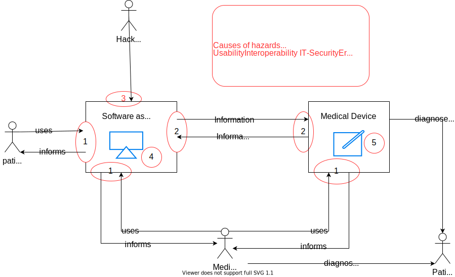

=== Hazards with software as medical device

Hazards with software as a medical device are always indirect hazards due to incorrect or missing information as output of the software.

* Incorrect information
* no information due to failure of the system

With knowledge of general medical processes, the following abstract hazards are conceivable

. incorrect diagnosis/treatment by the medical device
. Incorrect diagnosis/treatment by the doctor
. incorrect self-diagnosis/self-treatment by the patient

Due to the intended medical use, hazard 1 is ruled out, since the software does not make a diagnosis, but only provides important information for a doctor to make a diagnosis. Hazard 3 is excluded because patients are not users of the software. Due to the intended medical use, the only abstract hazard is the incorrect diagnosis by the doctor. This can then lead to the concrete danger of an excessive dose of medication.

The causes of hazards through software are

. Poor usability
. Lack of interoperability
. IT security
. Software errors (bugs, requirement errors, installation errors)

The cause of hazards due to Design-, Material- or Production-errors are not relevant to Software as medical device and have therefore not be taken under investigation. see <<Hazard_of_SaMD-image>>

[[Hazard_of_SaMD-image]]
