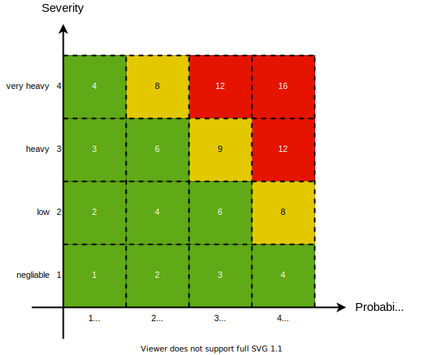

= Criteria for acceptance of risks

== Extent of damage and probability of occurrence

The levels for the extent of damage (= severity) and the probability of occurence are established on a product specific basis.

=== Severity
|===
| Extent of damage | Severity  | Example

| negliable        | 1  | Data are not available or cannot be evaluated, the measurement must be repeated
| low              | 2  | Data can be evaluated, report is created with a time delay, diagnosis is created with a time delay
| heavy            | 3  | Data evaluation is faulty, the analysis is repeated, the diagnosis is made with a time delay
| very heavy       | 4  | Data evaluation is faulty, the doctor includes wrong data in his diagnosis
|===

=== Probability
|===
| probability of occurence | Assessment  | Example

| theoretically conceivable | 1  | practically no occurrence
| very rare                 | 2  | (50x per 100.000 analyses)
| rare                      | 3  | (500x per 100.000 analyses)
| frequently                | 4  | (5.000x per 100.000 analyses)
|===

For hazard situations where the probability of occurrence of damage cannot be estimated, the risk shall be assessed solely on the basis of the extent of damage and appropriate measures to avoid the damage or reduce the extent of damage shall be defined.

== Risk classes

The risk potential ( R ) of a hazard is calculated from the product of the extent of damage (S) and the probability of occurrence (A). Both factors S and A are assigned a point system, see tables in <<_probability>>,<<_severity>>

The product R = S x A reflects the level of the individual risk of a hazard. The respective calculated value R is shown in <<risk_acceptance_matrix-image>> and leads to a classification into different regiones which are displayed in the following colors

* in green, if the value R does not exceed the number 6 and the risk of the hazard is to be classified as acceptable without further action
* in yellow, with values in a range 6 < R < 12 indicate an area where there are increased risks that should be mitigated if possible
* in red, with values of R ≥ 12 (red) indicate a high risk that must be mitigated as far as possible or subjected to an appropriate risk-benefit assessment.

[[risk_acceptance_matrix-image]]
