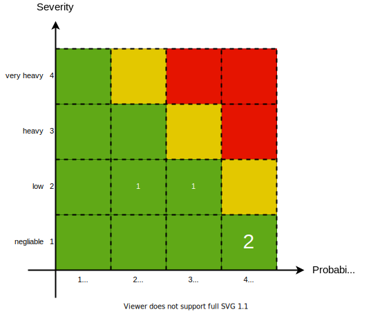

== Risk analysis table

Example how to document the risk analysis in a table during the process

[[risk_analysis-table]]
|===
|hazard |cause|S|P|R|measure for risk control|S|P|R|new risk

.3+| H1
.2+| cause C1.1
.2+| 3
.2+| 3
.2+| NA
| measure M1.1.1
.2+| 2
.2+| 3
.2+| A
.2+| no
| measure M1.1.2

| cause C1.2
| 2
| 2
| A
| n.a.
| 2
| 2
| A
| no

.2+| H2
| cause C2.1
| 1
| 4
| A
| n.a.
| 1
| 4
| A
| no

| cause C2.2
| 2
| 4
| NA
| measure M2.2.1
| 2
| 3
| A
| no

|===

|===
H: Hazard +
C: Cause +
S: Severity (S1=negliable, S2=low, S3=heavy, S4=very heavy) +
P: Probability (P1=theoretically inconceivable, p2=very rare, P3=rare, P4=frequently) +
R: Risk Potential with the corresponding assessment (A= Acceptable, NA = Not Acceptable) +
M: Measure (n.a. no measure necessary, because already situated in the acceptable region) +
The probabilities, severities and acceptance-regions refer to the risk acceptance matrix in <<risk_acceptance_matrix-image>>
|===

== Risk acceptance matrix before

After the assessment of the identified risks according to the severity and probabilty, its number is reflected in the risk acceptance matrix <<ra_matrix_before-image>>. The occurence of risks in the yellow or red region means that they have to be mitigated.
[[ra_matrix_before-image]]

== Risk acceptance matrix after

After the risk control measures have been applied the risks will move in the risk acceptance area, see <<ra_matrix_after-image>>. The occurence of no risks in the yellow or red region means that the mitigation has been successfull.
[[ra_matrix_after-image]]

