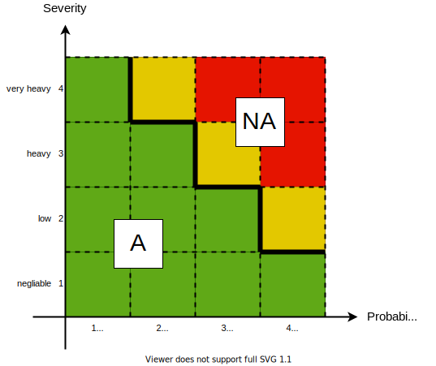
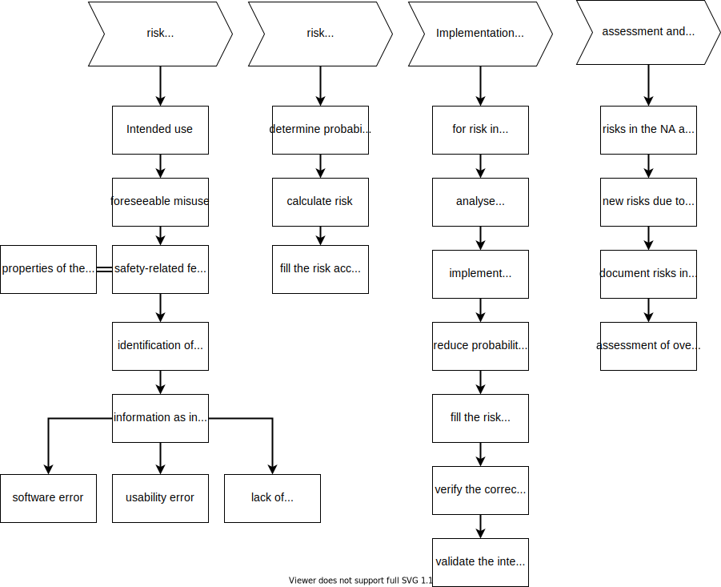

:pdf-themesdir: ../resources/themes
include::../product_properties.adoc[]
:hardbreaks-option:
:toc:
:toclevels: 4
= {documentname}
:author: PO
:documentname: G1.01.Risk_management_file
:example-from-Software_als_Medizinprodukt: true

// include::../requirements/*/use_cases/uc_*/risks/risk_*.adoc[]

== Risk management
The General Safety and Performance Requirements (GSPR)  1 - 9 require a risk management system with

* *Risk management plan* according to the harmonised standard DIN EN ISO 14971 consisting of 4 steps or stages
** *Risk analysis*: to identify hazards
** *Risk assessment*: for the evaluation of risks
** *Risk control*: the elimination or control of risks
** *adaptation*: by information from post-market surveillance

=== Definitions of Terms

* *Risk*: Expression for the combination of probability of occurrence of harm and severity of harm (source: MDR). (German expression:  Risiko)
* *Safety*: Designation for freedom from risk (source: DIN EN ISO 14971), (German Expression: Sicherheit)
* *Harm*: Injury or damage to human health or damage to property or the environment. (Source: DIN EN ISO 14971), (German Expression: Schaden)
* *Hazard*: potential source of harm (source: DIN EN ISO 14971). (German Expression: Gefährdung)
* *Hazard situation*: Circumstances in which people, goods or the environment are exposed to one or more hazards (source: DIN EN ISO 14971). (German Expression Gefährdungssituation)

Risks arise in general from

* design errors (e.g. software errors)
* material errors
* production errors
* usage errors or effects of the outside world due to lack of compatibility,
* interoperability
* IT security.

In the above definition, the probability of the occurrence of damage is considered and not the probability that one of the errors has occurred. As a rule, not one cause alone leads to a hazard (situation), but it is usually a chain of causes. This chain of causes is identified in risk management.

=== Sequence of measures
Sequence of measures by which risks are controlled by the manufacturer

. Minimise or eliminate risks through safe design
. Take protective measures (e.g. alarms) .
. Provide safety information (e.g. warnings) and training.

The possible risk control measures for software are in accordance with the sequence required by MDR and ISO 14971:

==== Inherent safety by design
Damage caused by the error is completely prevented. On the one hand, this can be achieved through appropriate architectural design (e.g. reliable systems through double design). On the other hand, via measures in the user interface, e.g. a prohibition of actions under certain conditions.

|===
*Example*: A code number is too high, therefore the software prohibits data storage.
|===

==== Protective measures:
With software, there are no protective measures in the actual sense, e.g. protective insulation or an apron against radiation exposure. With software, however, measures are possible in the user interface to warn the user of possible hazards, but not to completely prohibit him from continuing to work.

|===
*Example*: A code number is too high and the software asks via dialogue whether the user really wants to continue working with the data. The user must actively confirm this.
|===

==== Warnings:
Here, attention is drawn to possible hazards either in manuals. Or in the user interface by highlighting information without the user having to actively confirm.

|===
*Example*: A code number is too high and is displayed flashing in large letters.
|===

=== Responsibility of the top management

The top management defines the risk policy and the criteria for risk acceptance in a risk acceptance matrix. The axes here are.

* Probability of harm occurring
* Severity of the harm.

This matrix divides the whole area into different regions with the following meaning:

* Acceptable (green)
* Not Acceptable (yellow) If the risks remain in that area there has to be an individual assessment
* Not acceptable (red) If the risks remain in that area they are considered to be too high.

[[ra_matrix_regions_NA-image]]

=== Qualification of the staff

risk management is an interdisciplinary activity. The members of the risk-management team should have competencies in the following aspects

* technical, Software-Development
* medical knowledge
* risk-management-process

=== Risk management plan
The Qualitymanagemensystem requires that risk management is defined by a process. This process has to follow the risk management plan which contains:

* Responsibilities (who is doing what?)
* Timing of the risk management activities in the development process
* criteria for acceptance of risks (risk acceptance matrix)
* assessment of the overall residual risk (summation of all risks)
* the activities to verify the risk control measures
* Activities in the downstream phase (Post Market surveillance)

The risk management plan is part of risk management file

=== Risk management file
The risk management file is the documented result of the risk management  (see the process and steps <<risk_management_flow-image>>) and contains

* risk analysis
* risk assessment
* implementation and verification of risk control
* assessment and acceptance of the residual risks

[[risk_management_flow-image]]

//ToDo describe each of the above steps in detail?

== Risk acceptance matrix

include::risk_acceptance_matrix.adoc[leveloffset=+2]

include::risk_analysis_table.adoc[leveloffset=+2]

== Risk analysis

ifdef::example-from-Software_als_Medizinprodukt[]
In the following you can find the content of the corresponding sections from the example of the book.

include::Hazard_of_SaMD.adoc[leveloffset=+0]

=== Case Study: Initial Risk Analysis
In a initial Risk analysis the following hazards have been identified

* *wrong treatment due to wrong information*
If the information presented is incorrect or might be interpreted in a wrong manner, then this could lead to wrong treatment

* *no treatment due to wrong information*
additionally this could also lead to no treatment, although a therapy would have been indicated.

* The failure of the system is not treated as a hazard, because the investigations are not performed during a critical timeperiod and can be performed later.

The consideration of risks due to a lack of IT security has been newly added with the MDR. Care must be taken to ensure that security measures do not lead to other risks. Example: The protection of patient data through authentication to authorise users must not lead to the responsible doctors not being able to access relevant data in emergency situations.

=== Case Study 2 Risk-Meetings
The innovation-team has performed risk-analysis meeting and  identified the following causes of risks and corresponding measures in the risk meetings (the determination of severity and probability is neglected here):

|===
| Cause | Measure

|C1 Algorithm does not provide sufficiently accurate contours. Example: unusual shape of the QRS-complex, which is not taken into account in the training data.
|M1.1: The QRS-complexes are trained.

M1.2 The User can interactively choose a different time-episode fot the printout.

|C2 User confuses the different channels (leads) and is not aware that they belong together.
|M2.1 The leads are presented in column, one after the other for a specific time period (all leads are in the same coordinate system, with the time axis running from left to right)

|===

The defined measures go into the Product Requirements Spec as requirements and are elaborated in detail via software requirements in the Functional Spec.

endif::example-from-Software_als_Medizinprodukt[]

== Conclusion
|===
|Review of risk management process

|[__] the risk management plan has been appropriately implemented

|[__] the overall residual risk is acceptable

|[__] appropriate methods are in place to obtain relevant production and post-production information.
|===

== Approval

|===
|Approver |Date and signature

|Product owner
|

|R&D
|

|QM/RA
|
|===