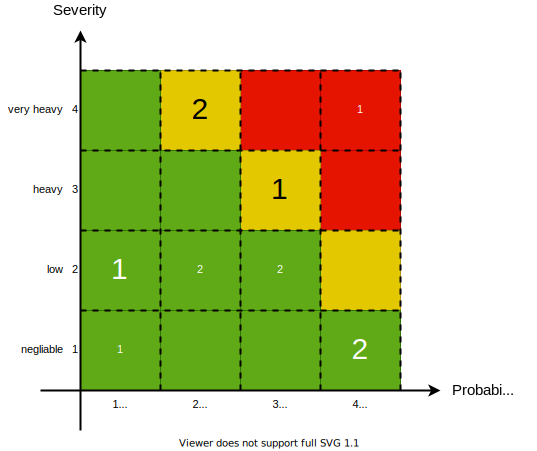

:pdf-themesdir: ../resources/themes
include::../product_properties.adoc[]
:hardbreaks-option:
:toc:
:toclevels: 4
= {documentname}
:author: PO
:documentname: G1.03.00.05.Risk_management_report

== Scope of the risk management report

The following items are considered in this risk management in the currently valid version, are considered in this risk management report:

|===
| Article number | Product name and description

|   | {product_id}
|   |

|===

Valid revision statuses of verification documents can be found in the currently valid risk management file.

== Implementation of the risk management plan

According to the risk management plan, at least the following criteria were to be assessed in the risk analysis

* risks regarding development/production
* Application, operation and user errors, related to the product and its 	accessories
* Risks regarding the infrastructure for software

The deliberate misuse of the product, its variants and accessories as well as processes not related to the product, its variants and accessories are not included.

The assessment of probability of occurrence and extent of damage was carried out according to the specifications in the risk management plan.

==	Relevant information from the production and downstream of the production phases

=== Production
// Description and discussion of the findings resulting from the production of the products.

=== Phases downstream of production

==== Customer complaints
//Description and discussion of customer complaints over a period of time

==== Incidents
//Description and discussion of incidents

==== Authority notifications including competitor products:
// Description and discussion of authority notifications for own and competitor products

==== Clinical studies and literature:
// Description and discussion of data from clinical trials and literature

== Risk-benefit analysis
The description of the classification of the risks according to the risk analysis. has been performed in G1.03.00.02 Risk Analysis

The Assessment of these risks have been performed in G1.03.00.03 Risk Assessment
The Mitigation through mesaures and a assessment of the residual risks hasd been performed in G1.03.00.04 Risk control

// Description of mitigation measures, if applicable.
=== Risk acceptance matrix before

After the assessment of the identified risks according to the severity and probability, its number is reflected in the risk acceptance matrix <<ra_matrix_before-image>>. The occurrence of risks in the yellow or red region means that they have to be mitigated.
[[ra_matrix_before-image]]

=== Risk acceptance matrix after

After the risk control measures have been applied the risks will move in the risk acceptance area, see <<ra_matrix_after-image>>. The occurrence of no risks in the yellow or red region means that the mitigation has been successfull.
[[ra_matrix_after-image]]

== Overall risk-benefit analysis
// Evaluation of the overall residual risks in relation to the medical benefits of the product.

The overall residual risk that arises from the use of the product {product_id} is classified as acceptable/unacceptable according to the results of the current risk analysis in relation to the medical benefit.

|===
|overall residual risk

| [__] acceptable
| [__] unacceptable acceptable.
|===

== Result of the review of the implementation of the risk management plan
// Summary. Report remains open until the measures are worked through and the requirements of the risk management plan are met

== Conclusion
|===
|Review of risk management process

|[__] the risk management plan has been appropriately implemented

|[__] the overall residual risk is acceptable

|[__] appropriate methods are in place to obtain relevant production and post-production information.
|===

== Appendix

=== Applicable documents

|===
|Document ID |Title

|G1.03.00.01  | Risk management plan
|G1.03.00.02  | Risk analysis
|G1.03.00.03  | Risk assessment
|G1.03.00.04  | Risk control
|G1.03.01.03  | Cyber Security Report
|===

=== Approval risk management report

|===
|Approver |Date and signature

|Product owner
|

|R & D
|

|RA
|
|===

=== Audit history Product-specific risk management report

|===
|Revision |Date |Author|Brief description of the change

|
|
|
|

|===